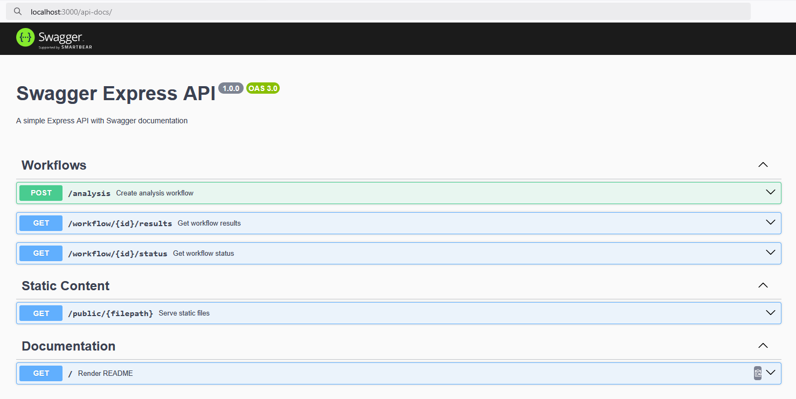
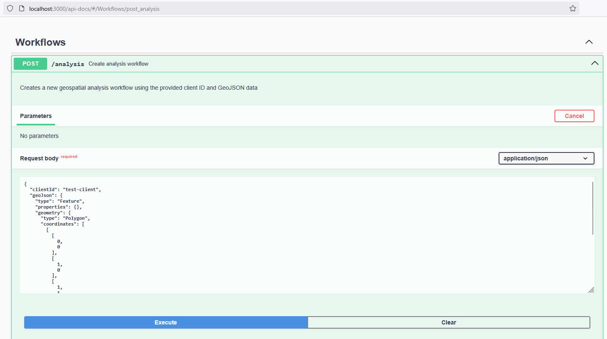
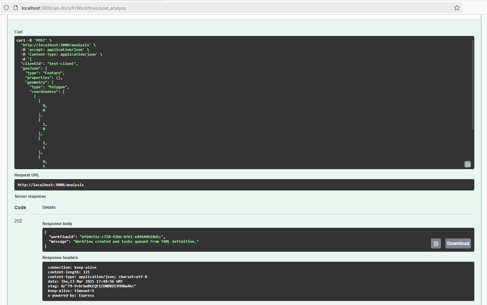
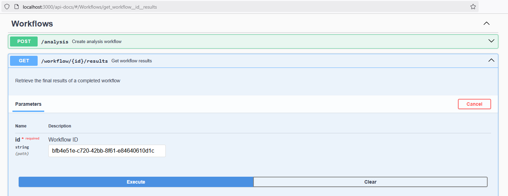
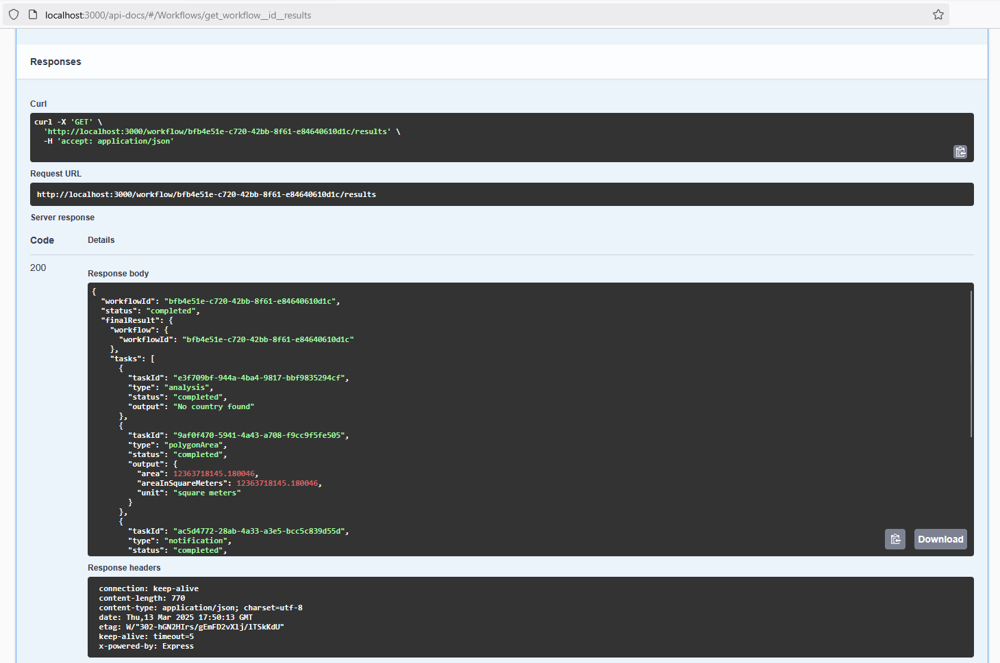

# OSApiens Backend Challenge

A robust backend system implementing an asynchronous task processing framework with support for complex workflows, dependency management, state transitions, and result aggregation—demonstrating clean architecture principles and design patterns.

## Table of Contents

- [Introduction](#introduction)
- [Technology Stack](#technology-stack)
- [Installation](#installation)
- [Running the Application](#running-the-application)
- [Architecture & Design Patterns](#architecture--design-patterns)
- [Task State Machine](#task-state-machine)
- [API Documentation](#api-documentation)
- [Testing](#testing)
- [Project Structure](#project-structure)

## Introduction

This project tackles the challenge of building a robust system to handle asynchronous workflows with interdependent tasks. It leverages TypeScript, Express, TypeORM, and follows clean architecture principles to deliver:

- Task scheduling and dependency management
- State machine for reliable task progression
- Asynchronous processing with background workers
- Result aggregation and reporting
- RESTful API for workflow management

## Technology Stack

- **TypeScript** - Strongly typed language
- **Express** - Web framework
- **TypeORM** - ORM for database operations
- **SQLite** - Database (configurable)
- **Jest** - Testing framework
- **YAML** - Workflow definitions

## Installation

1. **Clone the repository:**

   ```bash
   git clone https://github.com/seccijr/osapiens-backend-challenge.git
   cd osapiens-backend-challenge
   ```

2. **Install dependencies:**

   ```bash
   yarn install
   ```

3. **Configure TypeORM:**
   - The system uses SQLite by default for simplicity
   - Edit `data-source.ts` if you need to change database settings
   - Database migrations will run automatically on startup

## Running the Application

Start the application with:

```bash
yarn start
```

This will:
1. Initialize the database
2. Run any pending migrations
3. Start the Express server
4. Launch the background worker for asynchronous task processing

## Architecture & Design Patterns

This project implements several design patterns to achieve clean architecture:

1. **Factory Pattern**:
   - `WorkflowFactory`: Creates workflow instances from configuration
   - `JobFactory`: Instantiates appropriate job implementations
   - `ResultFactory`: Creates standardized result objects

2. **State Pattern**:
   - Tasks follow a well-defined state machine (see diagram below)
   - State transitions are strictly controlled and validated

3. **Repository Pattern**:
   - Clean separation between database operations and business logic
   - TypeORM entities provide persistent storage

4. **Service Layer**:
   - `TaskService`: Manages task execution and state transitions
   - `WorkflowService`: Orchestrates workflow creation and monitoring

## Task State Machine

Tasks follow a strict state machine to ensure reliable processing:

```
                                                       ┌─────────────┐ 
                                                       │             │ 
                                       ┌─────────────▶│  COMPLETED  │ 
                                       │               │             │ 
                                       │               └─────────────┘ 
                                       │                               
 ┌──────────┐   ┌──────────┐    ┌──────┴──────┐        ┌─────────────┐ 
 │          │   │          │    │             │        │             │ 
 │  QUEUED  ├─▶│   READY   ├──▶│ IN PROGRESS ├──────▶│   FAILED    │ 
 │          │   │          │    │             │        │             │ 
 └────┬─────┘   └──────────┘    └─────────────┘        └─────────────┘ 
      │                                                                
      │                                                ┌─────────────┐ 
      │                                                │             │ 
      └──────────────────────────────────────────────▶│   SKIPPED   │ 
                                                       │             │ 
                                                       └─────────────┘ 
```

State transitions:
- `QUEUED` - Initial task state upon creation
- `READY` - Task is ready for processing (all dependencies resolved)
- `IN PROGRESS` - Task is actively being processed
- `COMPLETED` - Task has finished successfully
- `FAILED` - Task has encountered an error
- `SKIPPED` - Task could no be executed due to missing dependencies fulfillment

The `TaskService` enforces these transitions.

## API Documentation

### Create an Analysis Workflow

**Endpoint:** POST `/analysis`

**Description:** Creates a new workflow for analyzing geographical data.

**Request:**

```json
{
    "clientId": "client123",
    "geoJson": {
        "type": "Feature",
        "properties": {},
        "geometry": {
            "type": "Polygon",
            "coordinates": [[
                [0, 0],
                [1, 0],
                [1, 1],
                [0, 1],
                [0, 0]
            ]]
        }
    }
}
```

**Response:**
```json
{
    "workflowId": "3433c76d-f226-4c91-afb5-7dfc7accab24",
    "message": "Workflow created and tasks queued from YAML definition."
}
```

### Get Workflow Status

**Endpoint:** GET `/workflow/:id/status`

**Description:** Retrieves the current status of a workflow.

**Response:**

```json
{
    "workflowId": "3433c76d-f226-4c91-afb5-7dfc7accab24",
    "status": "in_progress",
    "totalTasks": 5,
    "completedTasks": 3,
    "failedTasks": 1,
    "inProgressTasks": 2,
    "queuedTasks": 4,
    "skippedTasks": 1
}
```

### Get Workflow Results

**Endpoint:** GET `/workflow/:id/results`

**Description:** Retrieves the final results of a completed workflow.

**Response:**

```json
{
    "workflowId": "3433c76d-f226-4c91-afb5-7dfc7accab24",
    "status": "completed",
    "finalResult": {
        "tasks": [
            {
                "taskId": "task-1",
                "type": "polygonArea",
                "output": { "area": 42.5, "unit": "sq km" }
            },
            {
                "taskId": "task-2",
                "type": "dataAnalysis",
                "output": "Spain"
            }
        ],
        "summary": {
            "totalTasks": 2,
            "completedTasks": 2,
            "failedTasks": 0
        },
        "finalReport": "[{area: 42.5, unit: sq km}, 'Spain']"
    }
}
```

### Response Codes

- **200 OK**: Request successful
- **202 Created**: Workflow successfully created
- **400 Bad Request**: The workflow is not yet completed
- **404 Not Found**: The workflow ID does not exist
- **500 Internal Server Error**: Server-side error

## Testing

This project was developed using Test-Driven Development (TDD), with tests written before implementation. The test suite covers unit and integration tests.

### Running Unit Tests

```bash
yarn test tests/unit
```

This runs all unit tests using Jest, covering:
- Service classes (TaskService, WorkflowService)
- Factories (WorkflowFactory, JobFactory, ResultFactory)
- Job implementations
- State machine transitions
- Error handling

### Running Integration Tests

```bash
yarn test tests/integration
```

Integration tests cover the complete flow:
1. API request handling
2. Workflow creation
3. Task queueing and execution
4. Background worker processing
5. State transitions
6. Result aggregation
7. Final response generation

### Manual Testing

#### Using Swagger UI

The API is documented using Swagger UI. Access the documentation at [http://localhost:3000/api-docs](http://localhost:3000/api-docs) after running the application.



1) Click on the `/analysis` endpoint to expand the details.
2) Click on the "Try it out" button.
3) Enter the request body and click "Execute" to create a new workflow.




4) Use the `/workflow/{id}/status` and `/workflow/{id}/results` endpoints to check the workflow status and results.




#### Using Curl

For manual testing, use the following curl commands:

```bash
# Create a workflow
curl -X POST http://localhost:3000/analysis \
  -H "Content-Type: application/json" \
  -d '{
    "clientId": "client123",
    "geoJson": {
        "type": "Feature",
        "properties": {},
        "geometry": {
            "type": "Polygon",
            "coordinates": [[
                [0, 0],
                [1, 0],
                [1, 1],
                [0, 1],
                [0, 0]
            ]]
        }
    }
}'

# Check workflow status (replace with actual workflowId)
curl -X GET http://localhost:3000/workflow/3433c76d-f226-4c91-afb5-7dfc7accab24/status

# Get workflow results when completed
curl -X GET http://localhost:3000/workflow/3433c76d-f226-4c91-afb5-7dfc7accab24/results
```

## Project Structure

```
src/
├─ models/
│   ├─ Task.ts                  # Task entity with state management
│   ├─ Result.ts                # Result entity for storing outputs
│   ├─ Workflow.ts              # Workflow entity representing a job sequence
│
├─ jobs/
│   ├─ Job.ts                   # Job interface defining execution contract
│   ├─ DataAnalysisJob.ts       # Analyzes geographical data
│   ├─ EmailNotificationJob.ts  # Sends notifications
│   ├─ PolygonAreaJob.ts        # Calculates polygon area
│   ├─ ReportGenerationJob.ts   # Generates final reports
│
├─ workers/
│   ├─ TaskWorker.ts            # Background worker that processes queued tasks
│
├─ factories/
│   ├─ JobFactory.ts            # Creates appropriate job instances
│   ├─ ResultFactory.ts         # Creates standardized result objects
│   ├─ WorkflowFactory.ts       # Creates workflows from definitions
│
├─ routes/
│   ├─ RootRoute.ts             # Main application routes
│   ├─ AnalysisRoutes.ts        # Routes for analysis workflows
│   ├─ WorkflowRoutes.ts        # Routes for workflow management
│
├─ controllers/
│   ├─ WorkflowController.ts    # Handles workflow-related requests
│
├─ services/
│   ├─ WorkflowService.ts       # Business logic for workflows
│   ├─ TaskService.ts           # Manages task state transitions
│
├─ data-source.ts               # TypeORM database configuration
├─ index.ts                     # Application entry point
│
workflows/                      # YAML workflow definitions
│
tests/
├─ unit/                        # Unit tests for individual components
├─ integration/                 # End-to-end API tests
│
public/                         # Static files
```

